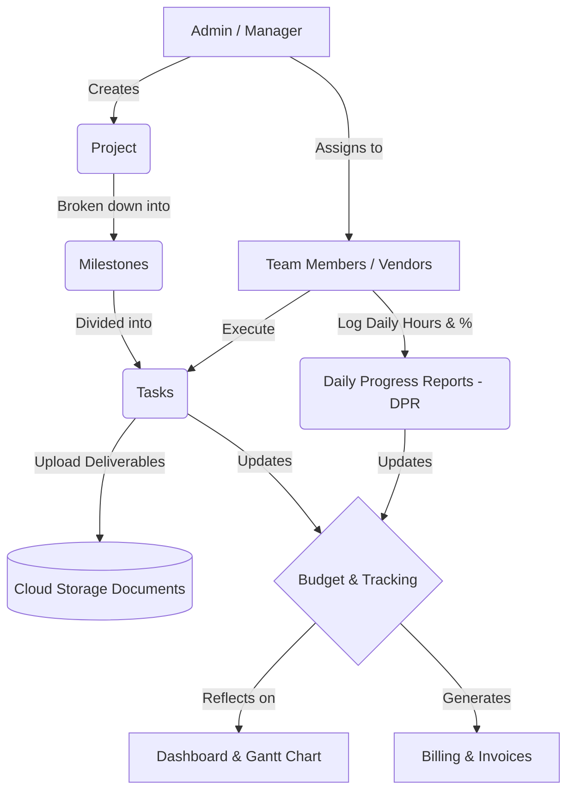

# CRM & Project Management: System Workflow

This document outlines the end-to-end business workflow and user journey within the CRM & Project Management System.

## High-Level Architecture Flow

## Step-by-Step User Workflow

### Phase 1: Project Initiation
1. **Login**: The Project Manager logs in securely using their registered Supabase email and password.
2. **Create Project**: Navigate to the **Projects** screen. Click "+ Add Project". Define the project name, client name, assigned manager, overall budget, and planned timeline.
3. **Team Setup**: Navigate to the **Team** screen. Ensure all internal employees and external vendors who will work on the project are added to the system.

### Phase 2: Planning & Breakdown
1. **Define Milestones**: Navigate to the **Milestones** screen. Select the newly created project and break it down into major phases (e.g., "Requirement Gathering", "Development", "UAT", "Go-Live").
2. **Assign Tasks**: Navigate to the **Tasks** screen. 
   - Select a Milestone.
   - Create specific tasks.
   - Assign each task to a specific Team Member or External Vendor.
   - Set planned start dates, end dates, and allocated budget for the task.

### Phase 3: Execution & Tracking
1. **Daily Progress (DPR)**: 
   - Team members navigate to the **DPR** screen.
   - They select their assigned tasks and log the hours they worked that day.
   - They update the completion percentage (e.g., "50% done").
2. **Document Management**: 
   - As work is completed, team members upload deliverables (e.g., design files, requirement docs).
   - Documents can be uploaded directly inside a Task, or via the **Documents** screen.
   - Files are securely uploaded to the `PRM document files` Supabase Cloud bucket and organized by Project > Milestone.

### Phase 4: Monitoring & Financials
1. **Visual Tracking (Gantt)**: Managers navigate to the **Gantt Chart** to see a visual timeline of all active projects to ensure deadlines are being met.
2. **Budget Monitoring**: Navigate to the **Budget** screen. The system automatically rolls up task budgets and displays the *Actual Cost* vs *Planned Budget*, allowing managers to instantly see remaining funds.
3. **Billing**: Once milestones are achieved, navigate to the **Billing** screen to track invoices sent to the client and payments received.

### Phase 5: Completion
1. **Project Closure**: Once all tasks hit 100% completion in the DPR, the manager updates the Project Status to "Completed".
2. **Notifications**: (If configured) Automated email notifications are sent out to stakeholders summarizing the project delivery.

---

> [!TIP]
> **Best Practice:** Always ensure Tasks are strictly linked to Milestones. This ensures that the Drill-Down view in the Documents and Budget screens remain perfectly organized.
